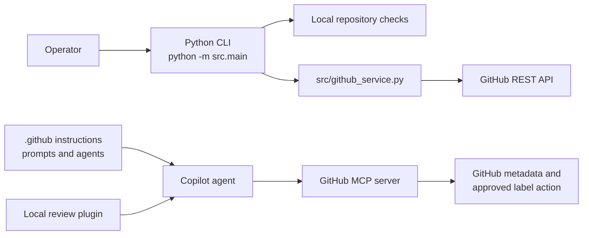

# GitHub Repository Health Checker

## What it is

A small Python CLI that checks repository hygiene locally and reads selected GitHub
metadata through an isolated service adapter.

## Architecture



The product CLI and the Copilot assignment workflow are intentionally separate:
the CLI uses the REST adapter, while Copilot uses MCP for bounded agent operations.

## Features

- Checks README, `.gitignore`, tests, dependency configuration, CI workflows, and docs.
- Counts open issues.
- Finds open pull requests inactive for more than 30 days by default, using `updated_at`.
- Reports `PASS`, `WARNING`, `FAIL`, or `UNKNOWN` without inventing an overall score.
- Keeps network access behind `src/github_service.py` so it can be mocked in tests.

## Requirements

- Python 3.12 for the assignment target. The implementation is also compatible with Python 3.11.
- A GitHub token in `GITHUB_TOKEN` for authenticated metadata reads.

## Installation

```bash
python3 -m venv .venv
. .venv/bin/activate
python -m pip install -r requirements.txt
```

## How to run

```bash
python -m src.main --path . --repo OWNER/REPOSITORY
```

Use `--inactive-days` to change the stale pull-request threshold, for example:

```bash
python -m src.main --path . --repo OWNER/REPOSITORY --inactive-days 45
```

The normal command is read-only. To request the narrowly scoped
`needs-attention` write for a stale PR, pass its number; the CLI validates the PR,
asks for interactive confirmation, applies only that label, and performs a fresh
read to verify it:

```bash
python -m src.main --path . --repo OWNER/REPOSITORY --apply-needs-attention 23
```

When GitHub is unavailable, GitHub-backed checks report `UNKNOWN`; local checks still run.

## How to test

```bash
python -m pytest
```

## Example output

```text
GitHub Repository Health: OWNER/REPOSITORY
========================================
[PASS   ] README: README.md found
[PASS   ] .gitignore: .gitignore found
[PASS   ] Tests: test directory or test files found
[WARNING] Stale pull requests: inactive for more than 30 days: #23
```

## Verification evidence

The suite was verified with Python 3.12:

```text
21 passed in 0.25s
```

The observed Git activity window for implementation was 51 minutes, from the first
implementation commit [`c11d18b`](https://github.com/RamithaMN/Github_Copilot_assignment/commit/c11d18b)
at 14:42:34 to the verification commit [`d72b973`](https://github.com/RamithaMN/Github_Copilot_assignment/commit/d72b973)
at 15:33:14 on 2026-09-26 (+04:00). This is a lower-bound repository activity
measure; it excludes unrecorded planning and review time.

## Submission evidence

- [Evidence index](docs/evidence/EVIDENCE_INDEX.md)
- [Workflow and Q1-Q5 answers](WORKFLOW.md)
- [Decision log](DECISIONS.md)
- [Approval and permission governance](APPROVALS.md)
- [Redacted multi-file agent transcript](docs/evidence/raw/copilot-q2-session-redacted.md)
- [Redacted reviewer transcript](docs/evidence/raw/copilot-review-session-redacted.md)
- [Redacted MCP transcript](docs/evidence/raw/copilot-mcp-session-redacted.md)
- [Approval prompts](docs/evidence/copilot-approval-prompts.md)
- [Exact Q2 stopping-marker receipt](docs/evidence/agent-session-q2-stopping-marker-2026-09-27.md)

No screenshots were needed; the submission uses linked redacted transcripts and
structured evidence receipts instead of embedding long logs.
